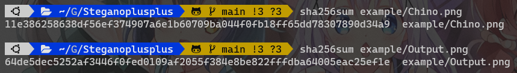
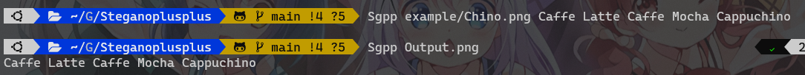

# Steganoplusplus

My Implementation of Steganography

## Idea

[Inspired by BornToDev's Video](https://www.youtube.com/watch?v=2HeyTSBqIzY)

## Example

### Original Picture vs Encrypted


### sha256sum



### Encrypt and Decrypt



## 🌿 Dependencies

- OpenCV 4.5.3

## ⚙️ Installation

```
git clone https://github.com/Leomotors/Steganoplusplus
cd Steganoplusplus
mkdir build && cd build
cmake .. && make
sudo make install
```

## 📚 Usage

`Sgpp "File Name" Message` to encrypt

`Sgpp "File Name"` to decrypt
